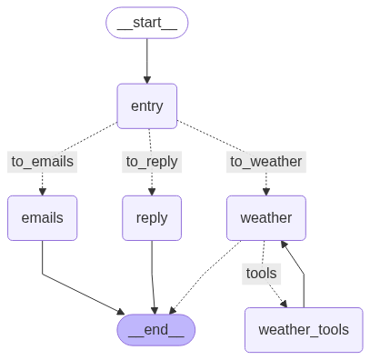

# basic-llm-orchestration
This repo is a beginner-level guide that helps you run an LLM orchestration over multiple intelligent tasks, specifically: **Email-writing**, **Weather-forecasting**, and **Chit-chatting**, using multiple LLM tools (libraries): **LangChain**, **LangGraph**, **CrewAI**, and **MCPs**.

## AI capabilities
- The weather agent (created as a ReAct agent with tools) uses two **MCP** tools:
    1. **"get_alerts"**: get today's weather alerts for a US state given its code (e.g. CA for California)
    2. **"get_forecast"**: get today's weather forecast for a given location in the state using lang, lat coordinates 
        - *can also set these information using only the name of the city, or even multiple cities given the state name*
- The Email crew (created as a Crewai Crew) with two Crewai agents:
    1. **Email Classifier**: classifies the category of the e-mail given the email body
    2. **Email Writer**: writes a professional reply e-mail given the email body and category provided through the Email Classifier
- This agent can also reply to general questions that the user provides.
- This agent is aware of the message history and can run multiple threads for multiple users
- The response of this agent is streamed, you don't have to wait until the full response is done.

## Prerequisites:
- Python interpreter
- Conda virtual environments
- Openai API key (or whatever llm you prefer to use)

## Setting up the environment:
- Create a new conda environment
```bash
conda create -n llm_orch python=3.10
```
- Activate the new environment
```bash
conda activate llm_orch
```
- Install all dependencies
```bash
pip install langchain langgraph langgraph-supervisor langgraph-swarm crewai openai langchain_openai python-dotenv mcp langchain-mcp-adapters
```
- Create a .env file with the api key inside
```bash
touch .env
echo 'OPENAI_API_KEY="you-api-key-here"' >> .env
```

## Steps to run the code
1. Open a terminal and activate the conda environment
```bash
cd basic-llm-orchestration
conda activate llm_orch
```
2. Run the MCP server to localhost port
```bash
python weather_server.py
```
3. Open a new terminal to run the application
```bash
python graph.py
```
4. Enjoy your ride
    - Input your text message in the terminal and see how the assistant responses

## Langgraph Graph visualization
